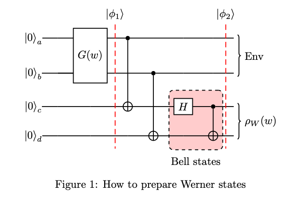
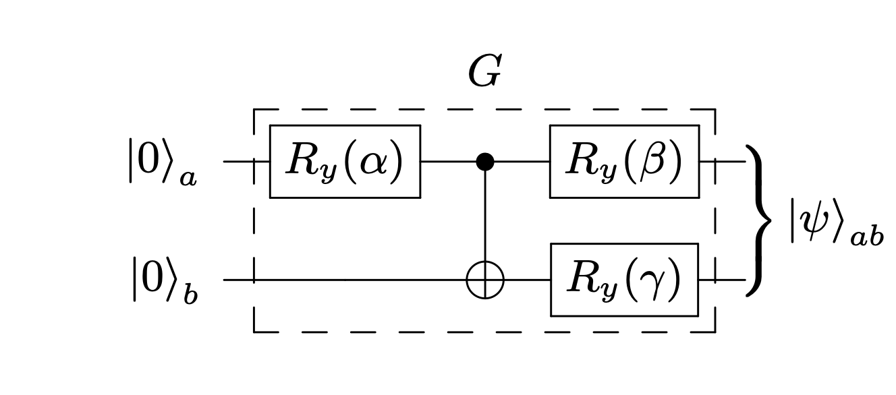

# Werner State Project (CS 309) — Qiskit + PennyLane 🧪🔬

A compact, reproducible exploration of Werner states and Bell-inequality violations. The project includes two notebooks:
- [project_qiskit.ipynb](./project_qiskit.ipynb): Qiskit-based construction, simulation, Peres test, CHSH operator, and IBM Quantum runtime demo.
- [werner.ipynb](./werner.ipynb): PennyLane version with equivalent state prep and measurements.

The handout and report are included: [Project Handout 2024.pdf](./Project%20Handout%202024.pdf), [Project_330500_340933.pdf](./Project_330500_340933.pdf).

## Circuit visuals 🧩
Werner state construction and the parameterized G gate used in the preparation circuit:




## Files in this release 📦
- [project_qiskit.ipynb](./project_qiskit.ipynb)
- [werner.ipynb](./werner.ipynb)
- [werner_circuit.png](./werner_circuit.png)
- [gate_g.png](./gate_g.png)
- [Project Handout 2024.pdf](./Project%20Handout%202024.pdf)
- [Project_330500_340933.pdf](./Project_330500_340933.pdf)

## Interesting techniques used 🧠
- Density operator workflows with Qiskit:
  - State prep via parameterized rotations and entangling gates; conversion to [`DensityMatrix`](https://docs.quantum.ibm.com/api/qiskit/qiskit.quantum_info.DensityMatrix) and subsystem reduction via [`partial_trace`](https://docs.quantum.ibm.com/api/qiskit/qiskit.quantum_info.partial_trace).
- Peres–Horodecki separability test:
  - Partial transpose using [`DensityMatrix.partial_transpose`](https://docs.quantum.ibm.com/api/qiskit/qiskit.quantum_info.DensityMatrix#partial_transpose) and eigenvalue analysis with `numpy.linalg.eigvalsh`.
- CHSH operator construction and evaluation:
  - Operator algebra with [`SparsePauliOp`](https://docs.quantum.ibm.com/api/qiskit/qiskit.quantum_info.SparsePauliOp), expectation via [`StatevectorEstimator`](https://docs.quantum.ibm.com/api/qiskit/qiskit.primitives.StatevectorEstimator), and Tsirelson bound comparison.
- Hardware-aware execution:
  - Backend discovery (`least_busy`), basis gate inspection, layout-aware observable mapping via [`apply_layout`](https://docs.quantum.ibm.com/api/qiskit/qiskit.quantum_info.SparsePauliOp#apply_layout), and transpilation with [`transpile`](https://docs.quantum.ibm.com/transpile) (optimization level 3).
- Operator arithmetic in PennyLane:
  - Tensor products with `@` and expectation values from symbolic operators ([PennyLane Operator docs](https://docs.pennylane.ai/en/stable/introduction/operations.html)).
- Reproducible analysis flows in Jupyter:
  - Parameter sweep over w ∈ [0, 1], plotting results with Matplotlib, and verifying analytic limits.

When images render inline, the PNGs are served as standard `image/png` assets (see MDN’s overview of [image types and formats](https://developer.mozilla.org/en-US/docs/Web/Media/Formats/Image_types)).

## Non‑obvious libraries and services 🔍
- Qiskit Primitives:
  - [`StatevectorEstimator`](https://docs.quantum.ibm.com/api/qiskit/qiskit.primitives.StatevectorEstimator) for ideal state expectations.
  - [`EstimatorV2` (IBM Runtime)](https://docs.quantum.ibm.com/api/qiskit-ibm-runtime/qiskit_ibm_runtime.EstimatorV2) for on-hardware expectation estimation.
- Qiskit Quantum Info:
  - [`Statevector`](https://docs.quantum.ibm.com/api/qiskit/qiskit.quantum_info.Statevector), [`DensityMatrix`](https://docs.quantum.ibm.com/api/qiskit/qiskit.quantum_info.DensityMatrix), [`SparsePauliOp`](https://docs.quantum.ibm.com/api/qiskit/qiskit.quantum_info.SparsePauliOp).
- IBM Quantum Platform:
  - [`QiskitRuntimeService`](https://docs.quantum.ibm.com/api/qiskit-ibm-runtime/qiskit_ibm_runtime.QiskitRuntimeService) for backend selection, jobs, and runtime configuration.
- PennyLane:
  - QNodes, device backends, and operator algebra for compact CHSH evaluations ([PennyLane docs](https://docs.pennylane.ai/)).

No web fonts or custom type systems are used in notebooks; Matplotlib uses its default stack (e.g., DejaVu).

## Project structure 🗂️
```text
/
├─ project_qiskit.ipynb
├─ werner.ipynb
├─ gate_g.png
├─ werner_circuit.png
├─ Project Handout 2024.pdf
└─ Project_330500_340933.pdf
```

- Images: circuit diagrams used directly in the notebooks for clarity and reproducibility.
- Notebooks: two independent implementations (Qiskit and PennyLane) covering the same problem: Werner state prep, Peres criterion, CHSH/Tsirelson checks, and (in Qiskit) optional hardware runs.

## Development notes 🧩
- Parameterized gate synthesis: G(α, β, γ) prepares the Werner branch; angles derived from the target distribution over Bell basis.
- Environment coupling and partial tracing: two ancilla qubits model environmental degrees of freedom; reduction yields ρ_W(w).
- Verification:
  - ρ_W(w) = (1−w)I/4 + w|Ψ⁻⟩⟨Ψ⁻| checked against construction.
  - CHSH: χ(w) approaches 2√2 at w = 1; threshold near the classical bound highlighted in plots.
- Notebook metadata indicates Python 3.x with NumPy/Matplotlib; figures generated with `mpl` drawers for circuit visualization.

Enjoy exploring entanglement, separability, and nonlocality in a compact, reproducible setup. 🚀